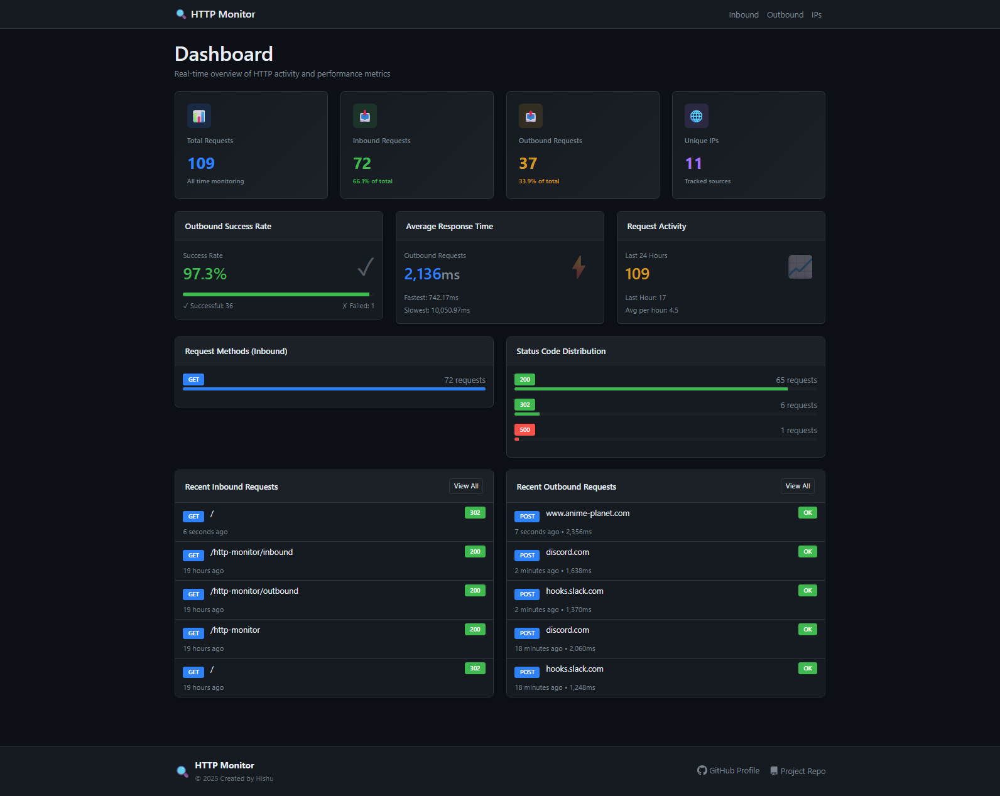
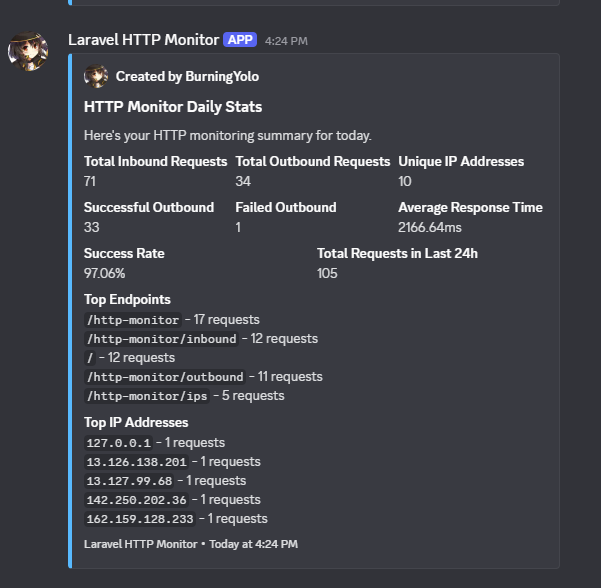
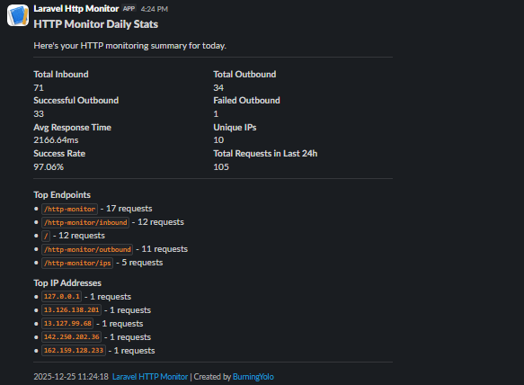

# Laravel HTTP Monitor

**Track & monitor inbound + outbound HTTP requests** in Laravel with IP tracking, optional geo-location, detailed analytics dashboard, website updates sent to **Discord** & **Slack** via webhooks.

## Installation

Install the package via Composer:

```bash
composer require burningyolo/laravel-http-monitor
```

Publish the configuration file:

```bash
php artisan vendor:publish --tag=request-tracker-config
```

Publish migrations:

```bash
php artisan vendor:publish --tag=request-tracker-migrations
```

Optionally, publish the views if you want front-end:

```bash
php artisan vendor:publish --tag=http-monitor-views
```

## Configuration

The configuration file `config/request-tracker.php` provides extensive options for customizing the package behavior:

### Basic Settings

```php
// Enable/disable the entire package
'enabled' => true,

// Track inbound requests
'track_inbound' => true,

// Track outbound requests
'track_outbound' => true,

// Store request/response headers
'store_headers' => true,

// Store request/response bodies
'store_body' => true,
```

### Exclusions

```php
// Exclude specific paths from inbound tracking
'excluded_paths' => [
    'horizon/*',
    'telescope/*',
    '_debugbar/*',
],

// Exclude specific hosts from outbound tracking
'excluded_outbound_hosts' => [
    'localhost',
    '127.0.0.1',
],

// These fields will be stored as ***omitted***
'omit_body_fields' => [
        'password',
        'password_confirmation',
        .......
    ],
```

### Discord & Slack Webhook Settings

```php
    // Discord Specific Webhook related fields
    'discord' => [
        'webhook_url' => env('REQUEST_TRACKER_DISCORD_WEBHOOK_URL', null),
        'enabled' => env('REQUEST_TRACKER_DISCORD_NOTIFICATIONS_ENABLED', false),
        'bot_name' => env('REQUEST_TRACKER_DISCORD_BOT_NAME', 'Laravel HTTP Monitor'),
        'avatar_url' => env('REQUEST_TRACKER_DISCORD_AVATAR_URL', 'https://avatars.githubusercontent.com/u/81748439'),

    ],
    // Slack Specific Webhook Related fields
    'slack' => [
        'webhook_url' => env('REQUEST_TRACKER_SLACK_WEBHOOK_URL', null),
        'enabled' => env('REQUEST_TRACKER_SLACK_NOTIFICATIONS_ENABLED', false),
    ],

    // the type of data & fields you wanna send via webhook
    'notifications' => [
        'enabled_fields' => [
            'total_inbound' => true,
            'total_outbound' => true,
            'successful_outbound' => true,
            'failed_outbound' => true,
            'avg_response_time' => true,
            'unique_ips' => true,
            'last_24h_activity' => true,
            'ratio_success_failure' => true,
            'top_endpoints' => true,
            'top_ips' => true,
        ],
    ],

```

### Automatic Tracking

Once installed, the package automatically tracks:

- All inbound requests to `web` and `api` middleware groups
- All outbound HTTP requests made via Laravel's HTTP client

### Dashboard

Access the built-in dashboard by visiting:

```
/http-monitor
```



## Artisan Commands

### View Statistics

Display statistics about tracked requests:

```bash
php artisan request-tracker:stats

# Show stats for last 30 days
php artisan request-tracker:stats --days=30
```

### Cleanup Old Logs

Remove old request logs based on custom criteria:

```bash
# Delete records older than 30 days
php artisan request-tracker:cleanup --days=30

# Clean only inbound requests
php artisan request-tracker:cleanup --type=inbound

# Clean by status code
php artisan request-tracker:cleanup --status=404

# Preview without deleting
php artisan request-tracker:cleanup --dry-run

# Also remove orphaned IP records
php artisan request-tracker:cleanup --orphaned-ips
```

### Prune Based on Retention Policy

Automatically prune logs according to retention settings in config:

```bash
php artisan request-tracker:prune

# Skip confirmation
php artisan request-tracker:prune --force
```

### Clear All Logs

Remove all tracked data (use with caution):

```bash
# Clear everything
php artisan request-tracker:clear

# Clear specific type
php artisan request-tracker:clear --type=inbound
php artisan request-tracker:clear --type=outbound
php artisan request-tracker:clear --type=ips

# Skip confirmation
php artisan request-tracker:clear --force

```

### Send Stats to Discord & Slack

Based on Config the Data will be sent of last 24 hours.

```bash
# Send Notification
php artisan request-tracker:send-stats

```





**Important note**

All listed Artisan commands are **manual only**. They do **not** run automatically.

If you want to run any of them on a schedule (e.g. daily stats, cleanup, etc.), add them to your Laravel scheduler.

```php

use Illuminate\Support\Facades\Schedule;

Schedule::command('request-tracker:send-stats')
        ->dailyAt('08:00');

```

### Accessing Tracked Data

Query tracked requests using the provided models:

```php

use Burningyolo\LaravelHttpMonitor\Models\InboundRequest;
use Burningyolo\LaravelHttpMonitor\Models\OutboundRequest;
use Burningyolo\LaravelHttpMonitor\Models\TrackedIp;

```

## Database Schema

### inbound_requests

Stores incoming HTTP requests with columns for method, URL, headers, body, status code, duration, user information, and more.

### outbound_requests

Stores outgoing HTTP requests with similar structure plus fields for tracking what triggered the request and success/failure status.

### tracked_ips

Stores unique IP addresses with optional geolocation data including country, region, city, coordinates, timezone, ISP, and organization.

View the model files `src/Models/` to get more info about the columns.

## Some Considerations

- Enable `geo_dispatch_async` to fetch geolocation data in background jobs
- Use `excluded_paths` to skip tracking of static assets and admin panels
- Consider disabling body storage for high-traffic applications

## License

This package is open-source software licensed under the MIT license.

## Credits

Developed by [Burningyolo](https://github.com/burningyolo)

## Contributing

Contributions are welcome! Please feel free to submit a Pull Request.

## Support

If you encounter any issues or have questions, please open an issue on GitHub.
